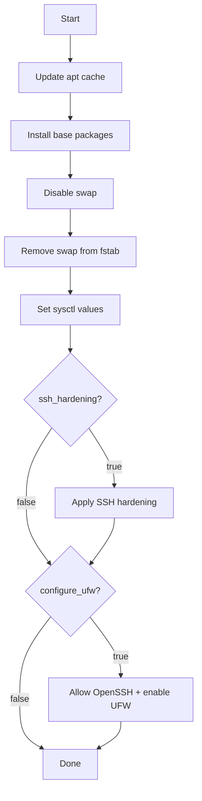

# Automation: Base OS (Ansible)

## Script location
- Playbook: `ansible/playbooks/base.yml`
- Variables: `ansible/group_vars/all.yml`

## What it does
1. Updates apt cache.
2. Installs base packages (curl, ca-certificates, open-iscsi, nfs-common, chrony).
3. Disables swap and removes it from `/etc/fstab` (required for Kubernetes).
4. Sets kernel sysctl values for Kubernetes networking.
5. Optionally hardens SSH (`ssh_hardening`).
6. Optionally enables UFW (`configure_ufw`).

## Inputs you must set
- `ssh_hardening` (true/false)
- `configure_ufw` (true/false)

## Flow

