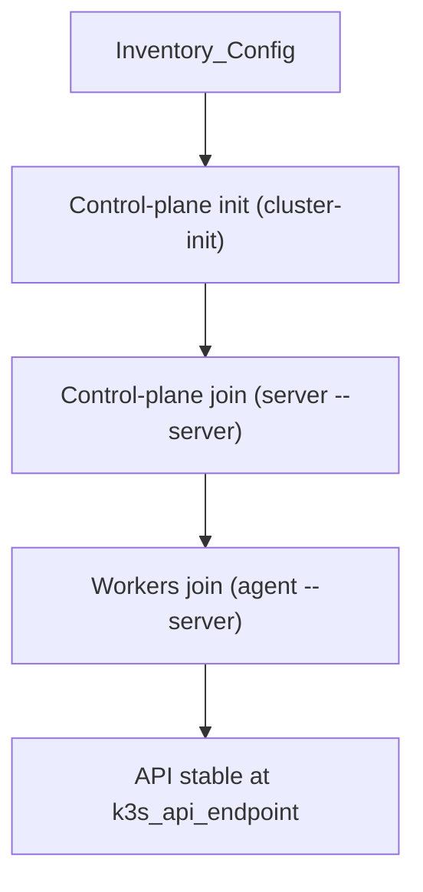

# Automation: K3s Cluster (Ansible)

## Script locations
- Playbook: `ansible/playbooks/k3s.yml`
- Role tasks: `ansible/roles/k3s/tasks/main.yml`
- Inventory: `ansible/inventory.ini`
- Variables: `ansible/group_vars/all.yml`

## What it does
1. Installs K3s on the control-plane init node (`k3s_cluster_init=true`).
2. Joins additional control planes to the first API endpoint.
3. Installs K3s agent on worker nodes.

## Inputs you must set
- `k3s_api_endpoint`: stable endpoint used for joining nodes.
- `k3s_token`: shared cluster token for all nodes.
- `k3s_tls_san_arg`: optional TLS SAN for the API endpoint.

## Notes
- `k3s_version` is defined but not used by the current role; installs use the
  default version from `get.k3s.io`.

## Manual commands (init/join)
Use these commands if you need to perform the join manually (same logic as the
Ansible role). Replace placeholders with your values.

### Init control plane (cp-1)
```
curl -sfL https://get.k3s.io | K3S_TOKEN="<cluster_token>" \
  sh -s - server --cluster-init --tls-san "<api_dns_or_ip>"
```

### Join control plane (cp-2/cp-3)
```
curl -sfL https://get.k3s.io | K3S_TOKEN="<cluster_token>" \
  sh -s - server --server "https://<k3s_api_endpoint>:6443" --tls-san "<api_dns_or_ip>"
```

### Join worker
```
curl -sfL https://get.k3s.io | K3S_TOKEN="<cluster_token>" \
  sh -s - agent --server "https://<k3s_api_endpoint>:6443"
```

## Join flow

