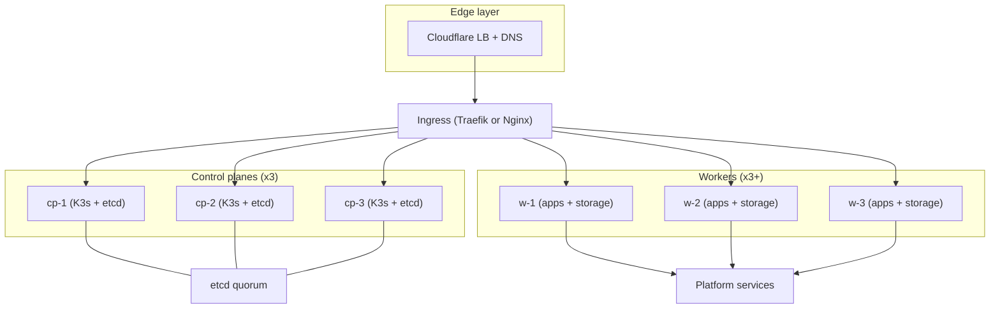

# Architecture

## Roles and placement
- Control planes (x3): K3s server + etcd, OpenObserve, Falco, log agents.
- Workers (x3+): application workloads, Longhorn, Argo CD, Cert-Manager, Kyverno,
  Trivy, Velero, Infisical.
- Cloudflare is the external DNS + Load Balancer entry point.

## Data flow
Client traffic terminates at Cloudflare, then the Load Balancer forwards to the
cluster ingress. Control planes host the API and etcd quorum; workers host
platform services and apps.

## Topology

