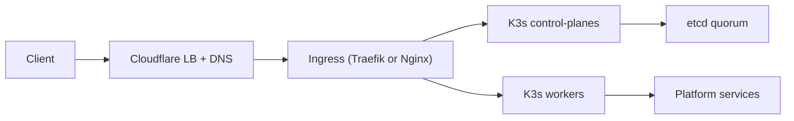

# MixServer Documentation

## Purpose
This documentation explains what each automation script does, how the final HA
infrastructure works (including failover), and how to configure Hetzner Cloud
and Cloudflare for this stack.

## Reading order
1. Architecture overview
2. Automation (Base OS, then K3s)
3. Providers (Hetzner Cloud, Cloudflare)
4. Operations & failover

## Key references
- Infrastructure details: `infrastructure-setup.md`
- Automation scripts: `ansible/`

## High-level architecture

