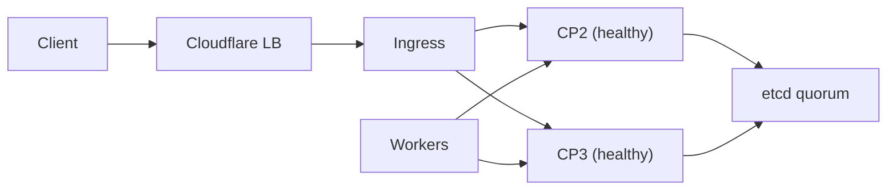

# Operations and Failover

## Quick checks
- `kubectl get nodes`
- `kubectl -n kube-system get pods`
- Confirm the API endpoint is reachable at `https://k3s_api_endpoint:6443`.

## Rollback
- Control-plane uninstall: `/usr/local/bin/k3s-uninstall.sh`
- Worker uninstall: `/usr/local/bin/k3s-agent-uninstall.sh`

## Failover model
- etcd needs a quorum (2 of 3 control planes) to stay writable.
- If one control plane fails, the API stays up via remaining nodes.
- If a worker fails, workloads reschedule on remaining workers.

## Validation steps
1. Stop one control plane and ensure the API remains available.
2. Drain and stop one worker and confirm workloads reschedule.
3. Verify Cloudflare Load Balancer health checks pass.
