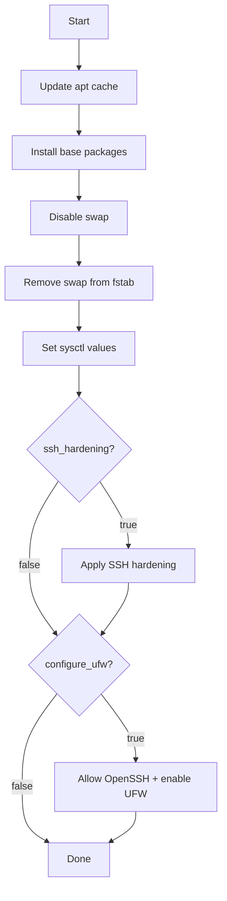

# Automatisation : Base OS (Ansible)

## Emplacement du script
- Playbook : `ansible/playbooks/base.yml`
- Variables : `ansible/group_vars/all.yml`

## Ce que le script fait
1. Met à jour le cache apt.
2. Installe les packages de base (curl, ca-certificates, open-iscsi, nfs-common, chrony).
3. Désactive le swap et le retire de `/etc/fstab` (obligatoire pour Kubernetes).
4. Applique des sysctl pour le réseau Kubernetes.
5. Durcit SSH en option (`ssh_hardening`).
6. Active UFW en option (`configure_ufw`).

## Paramètres à définir
- `ssh_hardening` (true/false)
- `configure_ufw` (true/false)

## Flux

