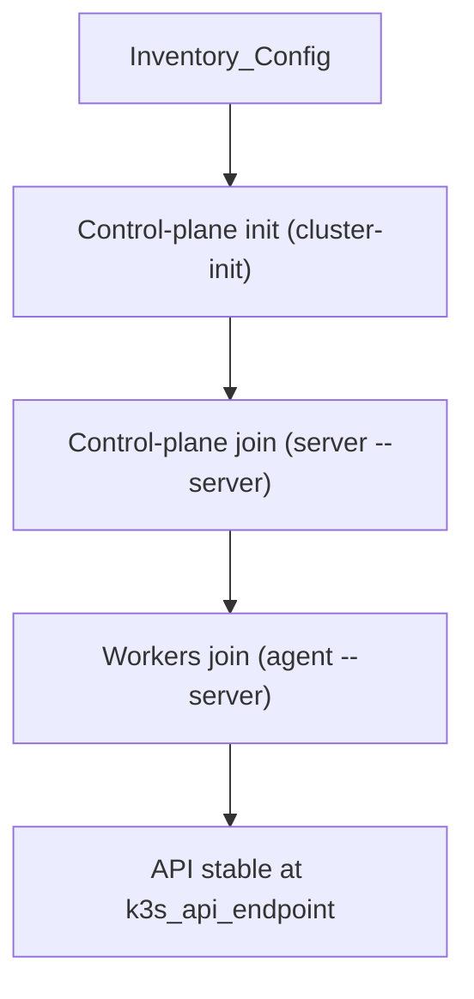

# Automatisation : Cluster K3s (Ansible)

## Emplacements des scripts
- Playbook : `ansible/playbooks/k3s.yml`
- Rôle : `ansible/roles/k3s/tasks/main.yml`
- Inventaire : `ansible/inventory.ini`
- Variables : `ansible/group_vars/all.yml`

## Ce que le script fait
1. Installe K3s sur le control-plane d’init (`k3s_cluster_init=true`).
2. Ajoute les autres control planes via l’API endpoint.
3. Installe K3s agent sur les workers.

## Paramètres à définir
- `k3s_api_endpoint` : endpoint stable pour le join.
- `k3s_token` : token partagé pour tout le cluster.
- `k3s_tls_san_arg` : SAN TLS optionnel pour l’API.

## Notes
- `k3s_version` est défini mais non utilisé par le rôle actuel ; l’installation
  utilise la version par défaut de `get.k3s.io`.

## Commandes manuelles (init/join)
Utiliser ces commandes si vous devez faire le join manuellement (même logique
que le rôle Ansible). Remplacer les placeholders par vos valeurs.

### Init control plane (cp-1)
```
curl -sfL https://get.k3s.io | K3S_TOKEN="<cluster_token>" \
  sh -s - server --cluster-init --tls-san "<api_dns_or_ip>"
```

### Join control plane (cp-2/cp-3)
```
curl -sfL https://get.k3s.io | K3S_TOKEN="<cluster_token>" \
  sh -s - server --server "https://<k3s_api_endpoint>:6443" --tls-san "<api_dns_or_ip>"
```

### Join worker
```
curl -sfL https://get.k3s.io | K3S_TOKEN="<cluster_token>" \
  sh -s - agent --server "https://<k3s_api_endpoint>:6443"
```

## Flux de join

