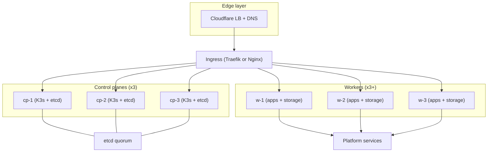

# Architecture

## Rôles et placement
- Control planes (x3) : K3s server + etcd, OpenObserve, Falco, agents logs.
- Workers (x3+) : workloads applicatifs, Longhorn, Argo CD, Cert-Manager, Kyverno,
  Trivy, Velero, Infisical.
- Cloudflare fournit le DNS et le Load Balancer en entrée.

## Flux
Le trafic client passe par Cloudflare, puis le Load Balancer envoie vers
l’Ingress du cluster. Les control planes hébergent l’API et le quorum etcd,
les workers hébergent les services plateforme et les apps.

## Topologie

