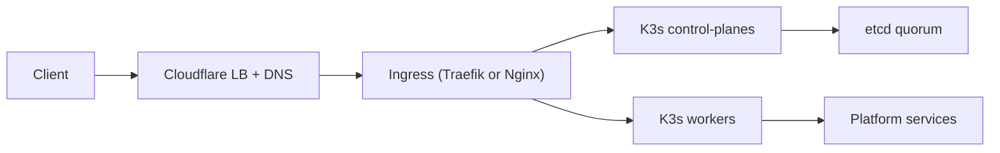

# Documentation MixServer

## Objectif
Cette documentation explique le rôle de chaque script d’automatisation, le
fonctionnement de l’infrastructure HA (y compris le failover), et la
configuration d’Hetzner Cloud et de Cloudflare pour ce stack.

## Ordre de lecture
1. Architecture
2. Automatisation (Base OS, puis K3s)
3. Fournisseurs (Hetzner Cloud, Cloudflare)
4. Opérations & failover

## Références clés
- Détails d’infrastructure : `infrastructure-setup.md`
- Scripts d’automatisation : `ansible/`

## Architecture de haut niveau

