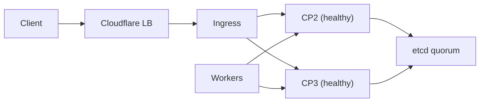

# Opérations et failover

## Vérifications rapides
- `kubectl get nodes`
- `kubectl -n kube-system get pods`
- Vérifier l’API via `https://k3s_api_endpoint:6443`.

## Rollback
- Désinstallation control-plane : `/usr/local/bin/k3s-uninstall.sh`
- Désinstallation worker : `/usr/local/bin/k3s-agent-uninstall.sh`

## Modèle de failover
- etcd nécessite un quorum (2 sur 3) pour rester en écriture.
- Si un control plane tombe, l’API reste disponible via les autres.
- Si un worker tombe, les workloads sont replanifiés.

## Étapes de validation
1. Arrêter un control plane et vérifier la disponibilité de l’API.
2. Drainer un worker et vérifier la replanification.
3. Vérifier les health checks du Load Balancer Cloudflare.
